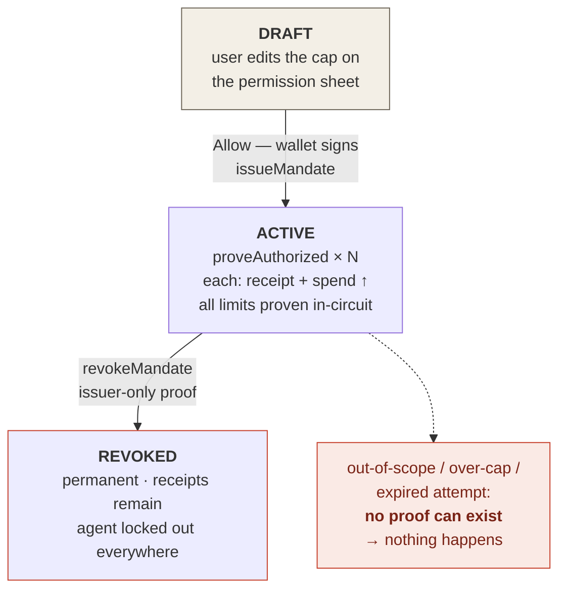

# Credential design

Where a token project documents token design, Grant documents the **mandate** — the credential that is our unit of
value. No new token exists in this system, by design.

## Anatomy of a mandate

| Field | Visibility | Meaning |
|---|---|---|
| `cap: Uint<64>` | Private (committed) | Maximum cumulative spend; user-editable on the permission sheet before granting |
| `expiry: Uint<64>` | Private (committed) | Timestamp after which no proof can be produced |
| `agentPk: Bytes<32>` | Private (committed) | Domain-separated key of the one agent this credential works for |
| `scope: Vector<8, Boolean>` | Private (committed) | Allowed action categories (purchase, subscribe, book, data-access…) |
| `mandateId` | Public (pseudonymous) | `H(domain ‖ principalPk ‖ nonce)` — unlinkable across a principal's mandates |
| `commitment` | Public (hiding) | `persistentCommit(terms, salt)` — binds the terms without revealing them |

## Lifecycle

## Receipts: the anti-review

Each authorization writes an `AuthReceipt { action, amount }` keyed by a single-use request id. Receipts are the
system's reputation substrate: an agent's track record is the set of receipts its credentials produced — verifiable
by anyone, writable only through valid proofs. This inverts the marketplace trust model: instead of reviews anyone
can fabricate, records no one can.

## Pseudonymity properties (v1)

| An observer learns | An observer can never learn |
|---|---|
| That a mandate exists (pseudonymous id) · its cumulative spend · each receipt's action + amount · timing · revocation events | Who the principal is · who/what the agent is · the cap · the scope · the expiry · any link between two mandates of the same person |

:::caution Known v1 trade-off
Authorizations under one mandate share its public id, so an observer can group a credential's actions together
(never linking them to the human). This kept budget enforcement simple for Wave 1. The Wave-2 design replaces
map-keyed spend with a **budget-note chain** (each authorization consumes a note via nullifier and emits a
re-blinded successor), making actions mutually unlinkable while preserving the cumulative cap — the standard
commitment/nullifier pattern of the Midnight ecosystem.
:::

## Why no token

A credential system gains nothing from a speculative asset and loses much: a token would financialize permissions,
add regulatory surface, and misalign incentives (volume over safety). Fees and costs ride the network's native
economics — see [economic sustainability](../business/economic-sustainability.md).
