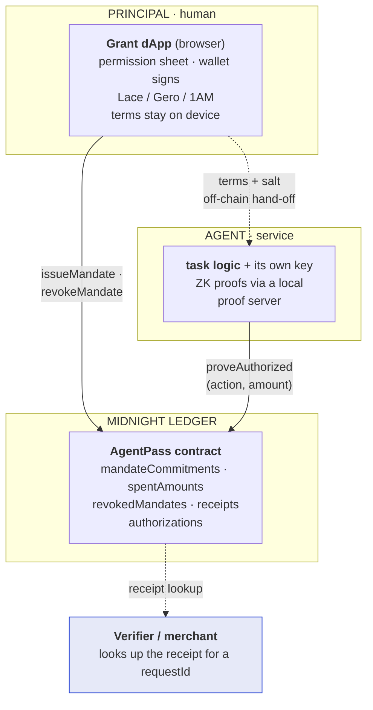

# General system architecture

## Why two layers: AgentPass and Grant

The single most important architectural decision in this project is the split between **AgentPass** (the credential
infrastructure) and **Grant** (the consumer application). Neither is an afterthought of the other.

**AgentPass exists because the missing piece in the agent economy is a primitive, not a product.** Every agent
platform, marketplace, and payment rail faces the same question — "is this agent authorized, within what limits, by
whom?" — and the answer must be reusable to matter. So the credential layer is deliberately app-agnostic: a single
Compact contract with three circuits, a typed API any service can embed, and no assumption about what an "agent" is.
It is the layer we intend other builders to adopt.

**Grant exists because infrastructure does not recruit users.** Nobody wakes up wanting a delegation credential;
people want an agent that renews their subscriptions without holding their card. Networks grow through applications
that hide the chain — so we built the application that makes the primitive legible in one screen (a permission
sheet) and desirable in one interaction (watching a forbidden action get blocked at proof time). Grant is
simultaneously the reference implementation, the adoption wedge, and the proof that the rails carry a product.

## System diagram

Solid arrows are on-chain transactions (each one a ZK proof); dashed arrows never touch the chain's write path —
the one off-chain hand-off at hire time, and the verifier's plain ledger read.

## Monorepo layout

| Package | Layer | Contents |
|---|---|---|
| `contract/` | AgentPass | `agentpass.compact` (3 proof circuits + pure derivations), witnesses, simulator, 15 tests |
| `api/` | AgentPass | `AgentPassAPI`: deploy/join per party, issue / prove-authorized / revoke, terms builders, key derivations |
| `agentpass-ui/` | Grant | The wallet dApp — directory, agent pages, permission sheet, dashboard, receipt anatomy — in the product design system |
| `agentpass-cli/` | Both | Walletless demo server, engineer console, two scripted e2e suites, faucet, fixed-port devnet compose |
| `website/` | — | This documentation site |

## The two-party state model

One deployed contract serves both roles: the principal joins with the principal's private state (issuing secrets),
the agent joins the same address with its own (agent key + handed-off terms). The off-chain hand-off of *terms +
salt* at hire time is a deliberate part of the protocol — it is how the agent gains the ability to prove, and
nothing more. In the browser, both states live client-side; in service deployments, the agent side runs headless —
which mirrors production, where agents are services, not browser tabs.

## Three surfaces, one contract

- **Wallet dApp** (canonical): the user's wallet signs everything; secrets in the browser.
- **Walletless demo**: a server custodies a devnet wallet so anyone can feel the full loop in one command — also an
  honest preview of the agent-as-a-service topology.
- **Engineer console**: the same protocol with the dual-ledger state made visible side-by-side — built for
  technical walkthroughs.

All three consume the identical `AgentPassAPI`; none has private forks of the logic. That is the practical payoff of
the infra/app split: surfaces are cheap, the primitive is singular.
